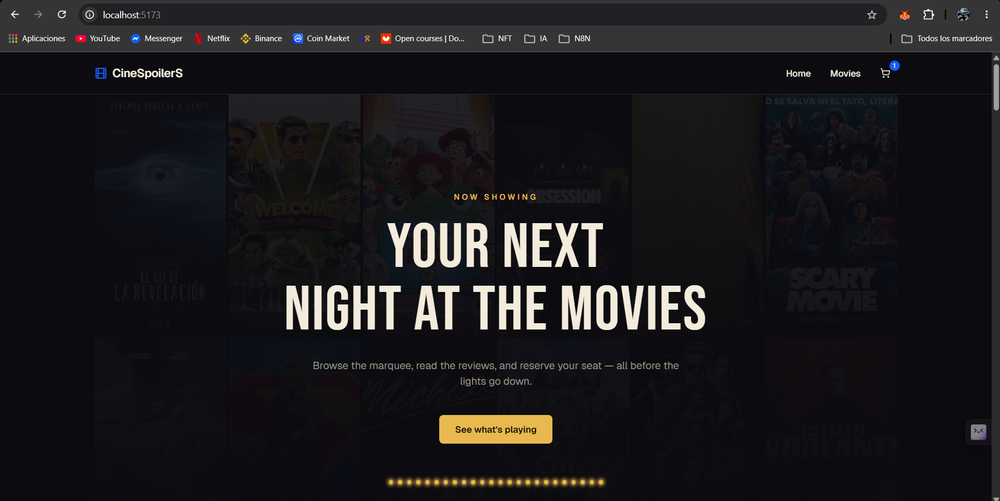
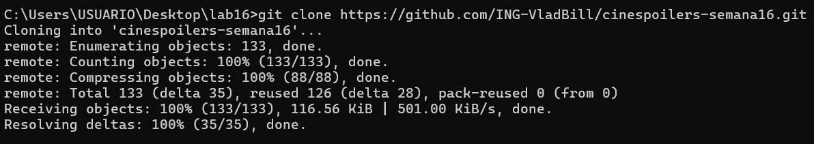
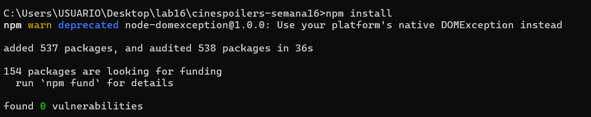
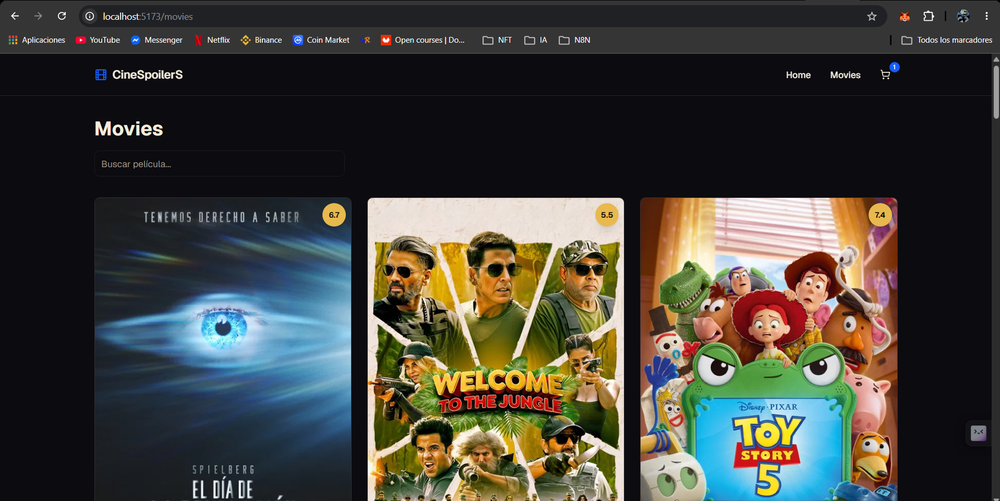

# 🎬 CineSpoilerS

Aplicación web para descubrir películas, ver sus detalles y simular la compra de entradas — construida con React, TypeScript, TMDB y Zustand.



## Índice

- [Stack](#stack)
- [Requisitos previos](#requisitos-previos)
- [Instalación](#instalación)
- [Variables de entorno](#variables-de-entorno)
- [Ejecutar el proyecto](#ejecutar-el-proyecto)
- [Estructura del proyecto](#estructura-del-proyecto)
- [Funcionalidades](#funcionalidades)
- [Scripts disponibles](#scripts-disponibles)

## Stack

- **React 19** + **TypeScript** + **Vite**
- **TanStack Query** — data fetching y caché de la API de TMDB
- **Zustand** — estado global (carrito de compras, pago simulado)
- **React Router** — enrutamiento
- **Tailwind CSS v4** + **shadcn/ui** — estilos y componentes
- **Axios** — cliente HTTP
- **TMDB API** — catálogo de películas, detalle, cast y trailers

## Requisitos previos

- Node.js 18 o superior
- Una API Key de [TMDB](https://www.themoviedb.org/settings/api) (gratuita)

## Instalación

Clona el repositorio e instala las dependencias:

```bash
git clone https://github.com/ING-VladBill/cinespoilers-semana16.git
cd cinespoilers-semana16
```



```bash
npm install
```



## Variables de entorno

Crea un archivo `.env` en la raíz del proyecto con las siguientes variables:

```
VITE_TMDB_BASE_URL=https://api.themoviedb.org/3
VITE_TMDB_API_KEY=tu_api_key_de_tmdb
VITE_TMDB_IMAGE_URL=https://image.tmdb.org/t/p/w500
```

> ⚠️ **Nunca subas tu `.env` al repositorio.** Ya debe estar ignorado en `.gitignore`. Si tu API Key llegó a quedar expuesta en algún commit anterior, regenérala desde el panel de TMDB.

El cliente de TMDB (`src/services/tmdb-client.ts`) usa estas variables para autenticar cada request con Bearer token:

```ts
export const tmdbClient = axios.create({
  baseURL: import.meta.env.VITE_TMDB_BASE_URL,
  headers: {
    Authorization: `Bearer ${import.meta.env.VITE_TMDB_API_KEY}`,
  },
});
```

## Ejecutar el proyecto

```bash
npm run dev
```

Abre [http://localhost:5173](http://localhost:5173) en tu navegador.

## Estructura del proyecto

```
src/
├── components/
│   ├── home/          # Hero section
│   ├── layout/         # Navbar, Footer, PageContainer
│   ├── movies/          # MovieCard, MoviesGrid
│   └── ui/              # Componentes shadcn/ui
├── data/                # Datos de ejemplo (legacy)
├── layouts/             # MainLayout
├── pages/                # Home, Movies, MovieDetail, Cart, Checkout, PurchaseSuccess
├── routes/               # Configuración de rutas
├── services/              # Cliente TMDB (axios)
├── store/                 # Estado global con Zustand (cart, payment, filters)
└── types/                 # Tipos de TMDB
```

## Funcionalidades

### Catálogo de películas

Búsqueda con debounce y paginación, consumiendo `/movie/popular` y `/search/movie` de TMDB.



### Detalle de película

Sinopsis, reparto, trailer embebido y botón de compra, usando `/movie/{id}` con `credits` y `videos`.

### Carrito y checkout simulado

El estado del carrito se maneja con Zustand (`useCartStore`) y persiste en `localStorage`. El checkout simula una pasarela de pago (`usePaymentStore`) con validación de formato de tarjeta, expiración y CVV — no procesa pagos reales.

## Scripts disponibles

| Comando           | Descripción                          |
| ------------------ | ------------------------------------- |
| `npm run dev`      | Levanta el servidor de desarrollo     |
| `npm run build`    | Compila TypeScript y genera el build  |
| `npm run lint`     | Corre ESLint sobre el proyecto        |
| `npm run preview`  | Sirve el build de producción localmente |